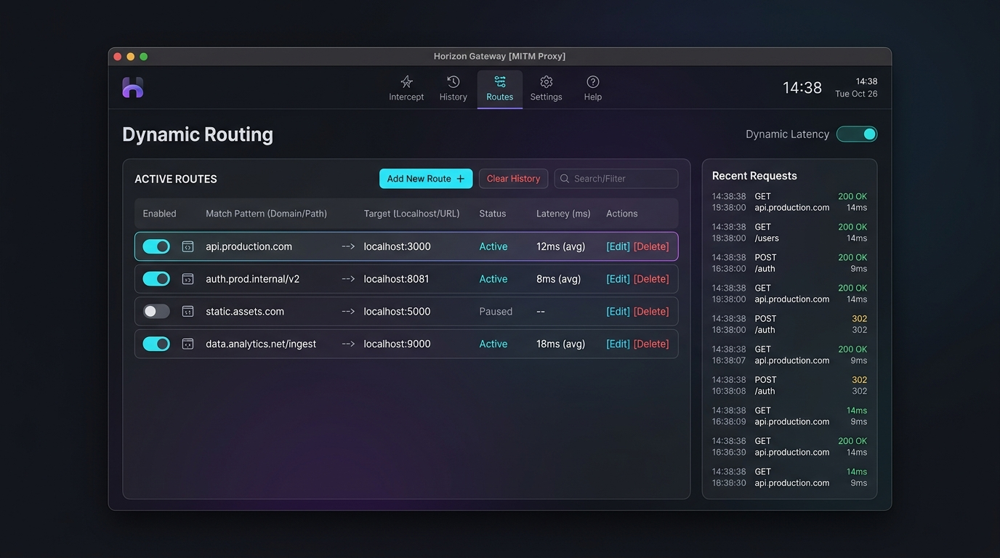
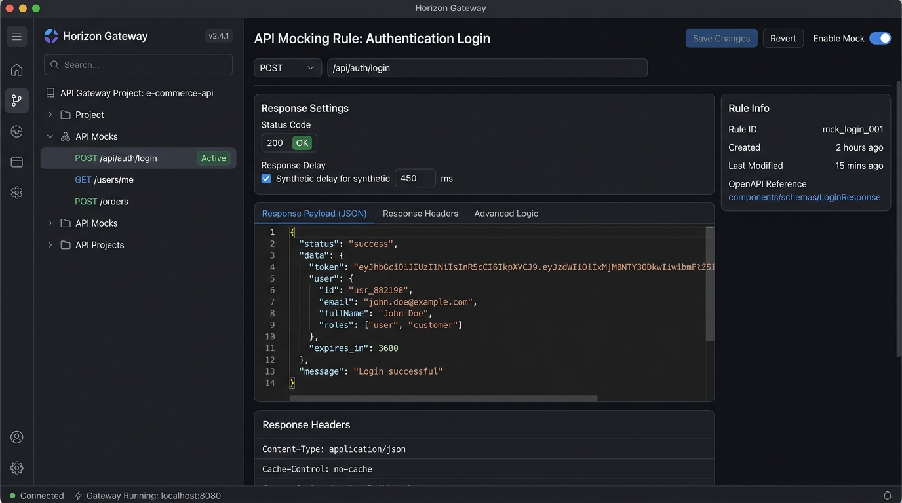
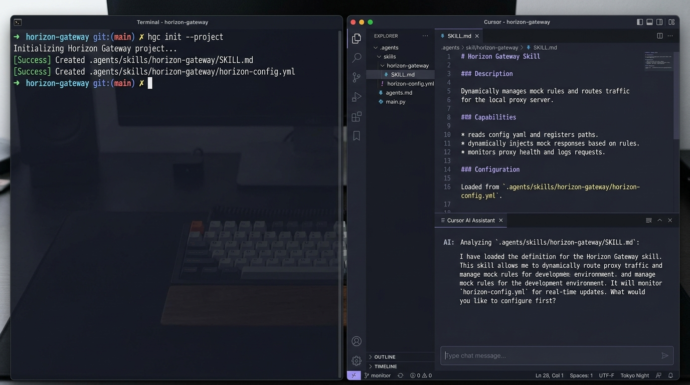

<div align="center">


# Horizon Gateway

프록시, 모킹, 도메인 상태를 데스크톱 앱 하나에 모았습니다.  
개인·상업 사용 무료. Cursor/Claude가 `hgc`로 로컬 라우팅과 모킹을 만집니다.

<p align="center">
  <a href="https://github.com/delete-horizon/horizon-gateway/releases"><strong>다운로드</strong></a> ·
  <a href="https://gateway.delete-horizon.com/ko"><strong>웹사이트</strong></a> ·
  <a href="./README.md"><strong>English Version</strong></a>
</p>

[](https://github.com/delete-horizon/horizon-gateway/releases)
[](./LICENSE)
[](#설치-방법)
[](https://tauri.app)

</div>

---

<div align="center">
  
</div>

---

## 왜 Horizon Gateway인가요?

현대 웹/앱 개발 환경에서는 개발자가 여러 개의 도구를 동시에 띄워두고 작업해야 합니다:
- HTTPS 패킷 분석을 위한 Charles 또는 Proxyman
- API 가상 응답을 위한 Mockoon 또는 Postman
- 모바일 및 외부 기기 테스트를 위한 Ngrok 또는 Cloudflare 터널링
- UI/UX 가이드라인 확인과 도메인 상태 체크를 위한 브라우저 개발자 도구 및 문서 시트

Horizon Gateway는 분산되어 있던 로컬 개발 및 네트워크 도구를 단 하나의 가볍고 빠른 네이티브 데스크톱 앱으로 통합합니다.

- **네이티브 성능**: Rust 및 Tauri 2 기반으로 제작되어 Electron 앱 대비 가벼운 ~16MB(Windows) 설치 용량과 최소한의 메모리 점유율을 제공합니다.
- **AI 에이전트 연동**: Cursor, Gemini CLI, Claude Code, Windsurf 등 AI 코딩 어시스턴트와 직접 연동할 수 있는 전용 콘솔 CLI (`hgc`)를 지원합니다.
- **간편한 설정**: 복잡한 환경 설정 없이 직관적인 인터페이스에서 프록시 라우팅, 모킹, 인스펙터를 즉시 제어할 수 있습니다.

---

## 실제 화면 미리보기

<div align="center">
  <p><strong>OpenAPI & API 모킹 에디터</strong></p>
  
  <br/><br/>
  <p><strong>hgc AI 에이전트 CLI와 Cursor 연동</strong></p>
  
</div>

---

## 핵심 기능

### 1. 고성능 로컬 MITM 프록시 및 동적 로컬 라우팅
- Hyper와 Tokio 기반의 고성능 HTTPS 복호화 프록시를 제공합니다.
- **동적 로컬 라우팅**: `/etc/hosts`나 DNS 설정 변경 없이, 특정 도메인(`*.example.com`) 트래픽을 로컬 개발 포트(`localhost:3000`)나 빌드 디렉토리로 즉시 우회(Routing)합니다.
- Teams, Slack, Zoom, SSO 등 업무 도구를 위한 TLS 바이패스 PAC 스크립트를 자동 생성합니다.

### 2. OpenAPI 탐색기 및 시나리오 기반 모킹
- OpenAPI 스펙 문서를 불러와 엔드포인트와 데이터 구조를 시각적으로 확인합니다.
- 백엔드 API 완성을 기다릴 필요 없이 상태 코드, 응답 지연, 커스텀 JSON 응답, 동적 헤더를 정의하여 프론트엔드를 독립적으로 테스트합니다.

### 3. 도메인 헬스체크 및 실시간 모니터링
- 개발, 스테이징, 운영 환경 도메인의 응답 시간, HTTP 상태 코드, SSL 인증서 유효성을 실시간으로 확인합니다.
- 도메인을 프로젝트나 그룹별로 묶어 대시보드에서 상태를 한눈에 관리할 수 있습니다.

### 4. AI 에이전트 CLI (`hgc`)
- 프록시 라우트, 모킹 규칙, 도메인 상태를 터미널 명령어로 직접 제어합니다.
- `hgc init --project` 명령으로 AI 코딩 도구(Cursor, Claude, Gemini, Windsurf, Copilot)에 전용 환경 제어 스킬을 자동 설치합니다.

### 5. 모바일 디버깅 및 보안 터널링
- **ADB 포트 포워딩**: USB로 연결된 안드로이드 기기의 트래픽을 로컬 프록시로 손쉽게 라우팅합니다.
- **터널링 연동**: Tailscale 및 Cloudflare 터널을 통해 로컬 개발 서버를 안전하게 외부에 공유하여 원격 QA 및 교차 기기 테스트를 수행합니다. *(참고: iOS USB 디버깅은 지원하지 않으며, Android ADB 또는 터널링을 권장합니다)*.

### 6. 라이브 캡처 및 UI/UX 가이드 인스펙터
- 모니터링 대상 웹 애플리케이션에 가벼운 인스펙터 오버레이를 주입합니다.
- 화면의 DOM 요소를 직접 선택하여 가이드 핀을 등록하고, 마크다운 기반의 디자인 정책을 연결할 수 있습니다.
- DaisyUI 5 디자인 토큰과 실시간으로 테마를 동기화합니다.

---

## 설치 방법

[GitHub Releases](https://github.com/delete-horizon/horizon-gateway/releases) 페이지에서 최신 설치 파일을 다운로드할 수 있습니다:

| 운영체제 | 패키지 | 아키텍처 |
|---|---|---|
| Windows | `.exe` / `.msi` | x64 (~16MB 설치 파일) |
| macOS | `.dmg` | Universal (Apple Silicon & Intel) |
| Linux | `.AppImage` / `.deb` / `.rpm` | x64 |

---

## 빠른 시작

1. **프록시 시작**: Horizon Gateway를 실행하고 사이드바에서 로컬 프록시를 켭니다.
2. **Root CA 설치**: **설정 -> Root CA -> Export & Install** 메뉴에서 HTTPS 복호화 인증서를 설치합니다.
3. **라우팅 규칙 추가**: **Proxy -> Routes**에서 대상 도메인(예: `api.example.dev`)을 로컬 주소(`http://localhost:3000`)로 연결합니다.
4. **API 모킹 테스트**: **APIs -> Mocking**에서 원하는 경로(예: `/user/profile`)에 모킹 규칙을 생성하고 프론트엔드에서 즉시 확인합니다.

---

## AI 에이전트 CLI 연동

Horizon Gateway는 별도 관리자 권한 없이 빠르게 실행되는 콘솔 CLI 클라이언트 `hgc`를 포함하고 있습니다.

```bash
# 현재 프로젝트에 AI 에이전트 스킬 설정 초기화
hgc init --project

# 사용 가능한 전체 API 명령어 목록 확인
hgc list

# 특정 명령어 사용법 및 스키마 확인
hgc help get_domains

# 백엔드 명령어 직접 실행
hgc run get_domains '{}'
```

---

## 기술 스택

- **데스크톱 셸**: Tauri 2, Rust, Tokio, Hyper, Axum
- **프론트엔드 UI**: React 19, Vite 7, TanStack Router, Jotai, Tailwind CSS 4, DaisyUI 5
- **도구 및 품질 관리**: TypeScript 5.8, Biome, pnpm

---

## 라이선스 및 안내

- **개인·상업 사용 무료**: 기본 데스크톱 앱 기능 및 CLI는 개인 및 상업적 목적으로 무료 제공됩니다. 소스 코드는 공개되지 않으며 공식 설치 파일을 다운로드하여 사용하시면 됩니다.
- **제작자**: 규연 (kyuyeon)
- **문의**: `hello@delete-horizon.com`
- **변경 이력**: 버전별 상세 내역은 [CHANGELOG.ko.md](./CHANGELOG.ko.md)를 확인하세요.
