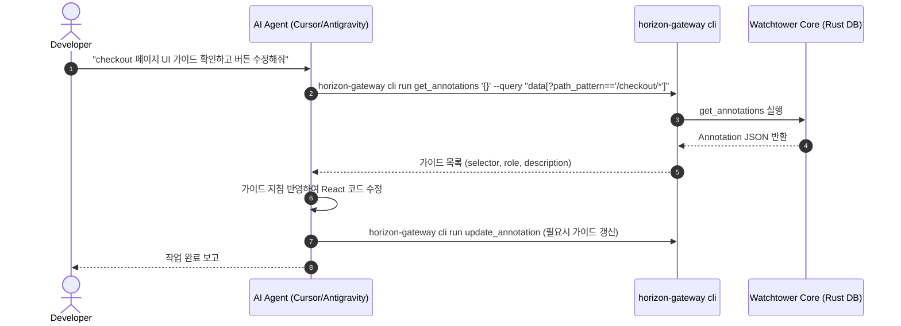

# 기획: Horizon Gateway CLI - UI/UX 가이드(Annotation) 연동

> 작성일: 2026-08-10 · 대상 제품: **Horizon Gateway (Watchtower)**  
> 범위: `horizon-gateway cli init` 스킬 문서를 통한 UI/UX 가이드(Annotation) CRUD 에이전트 연동  

---

## 1. 배경 및 목적

### 1.1 배경
* Watchtower는 라이브 웹 캡처 및 인스펙팅을 통해 특정 도메인, URL, CSS Selector 단위의 **UI/UX 가이드(Annotation)**를 등록하고 관리하는 기능을 제공한다.
* AI 에이전트(Cursor, Antigravity, Claude Code 등)가 특정 라우트나 UI 컴포넌트 개발 시, 해당 페이지에 지정된 UI/UX 가이드를 준수하도록 만드는 인프라가 필요하다.

### 1.2 목적
* 별도의 신규 CLI 헬퍼 스크립트를 추가하지 않고, 이미 구축된 **`horizon-gateway cli run` Headless 실행 체계**를 100% 활용한다.
* `horizon-gateway cli init` 명령어 실행 시 에이전트 환경에 전달되는 `SKILL.md` 파일에 **UI/UX 가이드(Annotation) 조회·등록·수정·삭제(CRUD) 명세 및 예시**를 추가하여 에이전트가 이를 직접 활용할 수 있도록 한다.

---

## 2. 현황 및 인프라 분석

### 2.1 기존 인프라 검증
Horizon Gateway 백엔드(Rust Specta)에는 이미 가이드(Annotation) 관련 Headless CLI 커맨드가 준비되어 있다.

| Specta Command | 기능 설명 | GUI 필요 여부 |
|----------------|----------|---------------|
| `get_annotations` | 전체 또는 조건별 가이드 목록 조회 | Headless 가능 (`guiOnly: false`) |
| `add_annotation` | 신규 UI/UX 가이드 등록 | Headless 가능 (`guiOnly: false`) |
| `update_annotation` | 기존 UI/UX 가이드 정보 수정 | Headless 가능 (`guiOnly: false`) |
| `delete_annotation` | 지정된 ID의 UI/UX 가이드 삭제 | Headless 가능 (`guiOnly: false`) |
| `import_annotations` | JSON 형태 가이드 대량 복원/가져오기 | Headless 가능 (`guiOnly: false`) |

### 2.2 CLI Init 구조
`horizon-gateway cli init` 실행 시 `src-tauri/resources/skills/horizon-gateway/SKILL.md` 파일 내용이 대상 에이전트 환경(예: `.agents/skills/horizon-gateway/SKILL.md` 또는 `~/.cursor/skills/horizon-gateway/SKILL.md`)으로 복사된다.

---

## 3. 변경 상세 계획

### 3.1 변경 대상 파일
1. `src-tauri/resources/skills/horizon-gateway/SKILL.md` (바이너리 임베딩용 원본)
2. `.agents/skills/horizon-gateway/SKILL.md` (로컬 프로젝트 에이전트 스킬)

### 3.2 `SKILL.md` 추가/수정 내용

#### A. Task 명령 표 업데이트
`Recommended commands by task` 항목에 가이드 CRUD 명령어를 구체화한다.

```markdown
| UI/UX Guides (Annotations) | `get_annotations`, `add_annotation`, `update_annotation`, `delete_annotation` |
```

#### B. 가이드 전용 세부 가이드 섹션 신설

```markdown
### UI/UX Guides (Annotations)

Use when inspecting or maintaining UI/UX guidelines and selector annotations for specific pages or domain patterns before editing UI code.

#### 1. Read / Search Guides
Fetch UI/UX guides and filter by domain or path pattern using `--query`:

```bash
# Get all guides for a specific domain
horizon-gateway cli run get_annotations '{}' --query "data[?domain=='modetour.dev'].{id,selector,role,description,host_pattern,path_pattern}"

# Get guide by specific ID
horizon-gateway cli run get_annotations '{}' --query "data[?id=='g-101']"
```

#### 2. Add Guide
Register a new UI/UX guide for a selector / element:

```bash
horizon-gateway cli run add_annotation '{"id":"g-101","selector":"#submit-btn","role":"Submit Button","description":"Prevent duplicate clicks with 3s lock","tagName":"BUTTON","thumbnail":"","content":"","domain":"modetour.dev","url":"https://modetour.dev/checkout","timestamp":1770685200}'
```

#### 3. Update Guide
Modify description, selector, or pattern for an existing guide:

```bash
horizon-gateway cli run update_annotation '{"id":"g-101","description":"Lock 5s and show success toast"}'
```

#### 4. Delete Guide
Remove an obsolete guide by ID:

```bash
horizon-gateway cli run delete_annotation '{"id":"g-101"}'
```
```

---

## 4. 에이전트 활용 시나리오 (Workflow)



---

## 5. 검증 및 수용 기준 (Acceptance Criteria)

- [x] `src-tauri/resources/skills/horizon-gateway/SKILL.md` 및 `.agents/skills/horizon-gateway/SKILL.md`에 UI/UX 가이드 섹션이 정상 반영됨
- [x] `horizon-gateway cli run get_annotations '{}'` 실행 시 현재 저장된 가이드 목록이 JSON으로 정상 출력됨
- [x] `horizon-gateway cli init` 실행 후 에이전트가 가이드 CRUD 명령을 인지하고 실행 가능함

### 관련 설계

- Locator / Validation / Promote: [annotation-locator-validation.md](./annotation-locator-validation.md)

### 구현 메모 (2026-08-10)

- `--query`는 JMESPath가 아님. 올바른 예: `data[domain==modetour.dev].{id,selector,role,description}`
- `update_annotation`은 `id` + `role` + `description` 필수
- `pathPattern` 쿼리는 exact equality (glob 아님)
- 스킬 frontmatter `description`에 UI/UX guides / annotations 트리거 키워드 추가됨
